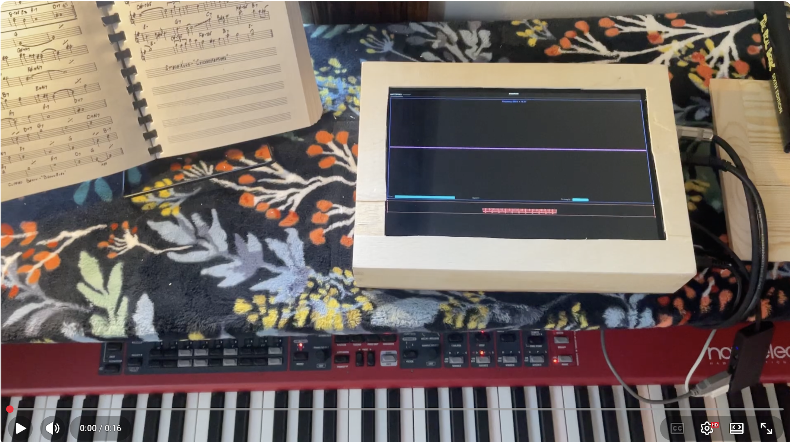
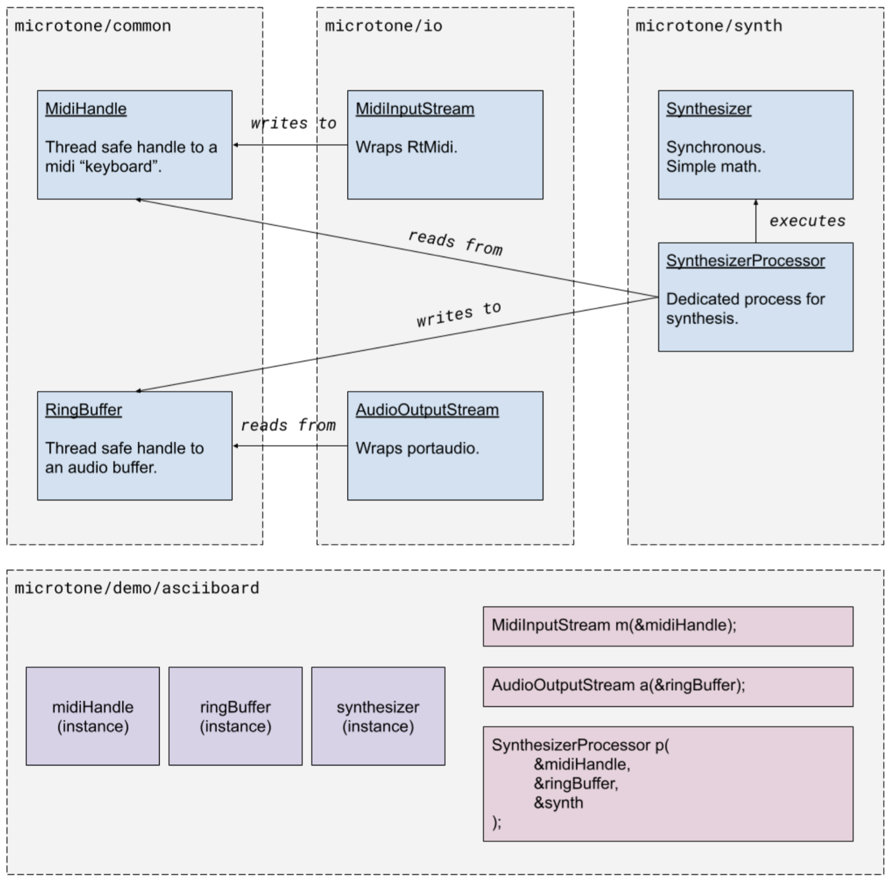
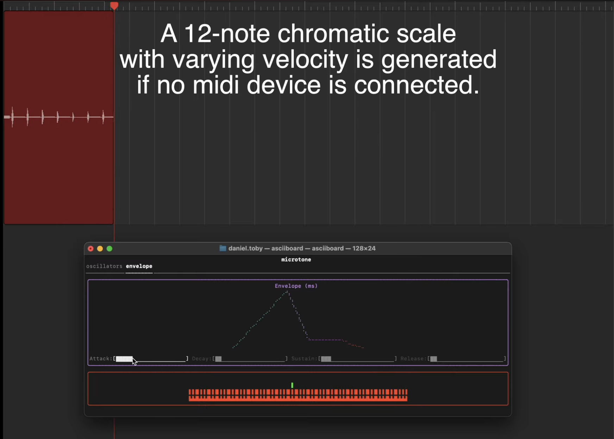

# microtone
A cross-platform polyphonic synthesis library and MIDI player.

[](https://youtu.be/3SpMUx2KE4o)

### Build Steps
```sh
git clone git@github.com:DanielToby/microtone.git
mkdir build-microtone-release && cd build-microtone-release
cmake ../microtone -DCMAKE_BUILD_TYPE=Release
cmake --build . --config Release
./Asciiboard/asciiboard
```

### About

This is a lightweight wavetable synthesizer with a few extra DSP features. I wanted a zippy synth that I could spin up for fun, or use as a building block for other stuff.

Unfortunately std::audio is still in early stages, so I used [portaudio](http://www.portaudio.com/) for a more robust real-time audio callback.

The audio synthesis techniques demonstrated in this project can be attributed to [The Audio Programming Book by Richard Boulanger](https://mitpress.mit.edu/books/audio-programming-book) and tutorials by [Bela](https://learn.bela.io/using-bela/languages/c-plus-plus/).

Midi input is handled by the [RtMidi library](https://www.music.mcgill.ca/~gary/rtmidi/).

### Hardware Integration
Because this demo app runs in the shell and is fully cross-platform, running it on a Raspberry Pi took very little additional work. See the [Pi Setup instructions](https://github.com/DanielToby/microtone/blob/util/README.md).


The HDMI display and pi are powered off of the same 12V power source. I used a buck converter to reduce power to 5V for the pi. I soldered 1/4 input jacks to the underside of a cheap DAC that sits on the Pi's GPIO pinout.

[](https://youtu.be/aejMkUpq9vs?si=gbkU0w9zX1il4FNy)

### Audio Architecture

Libraries in this repo are designed to reduce coupling between synthesis, midi, audio output, and UI.


### Features
- Wavetable oscillation that supports fill functions as lambdas. Wavetables are passed into the synth::Synthesizer constructor with adjustable weights. This data is shared between the oscillators.
- Polyphony -- 127 voices, each wrapping an oscillator.
- Envelopes (Attack, Decay, Sustain, Release): The oscillators belonging to each voice conform to configurable envelopes. Without this, you'd hear clicks and pops when notes are released or pressed in rapid succession -- at least in continuous functions like sine waves. This also adds richness and character to the sound.
- Filters (low-pass, high-pass, etc).
- Forwarded audio buffers -- update your UI with live audio data by passing a lambda to the synth::Synthesizer constructor.
- Midi input, including the sustain pedal.

### Audio Effects
I added abstractions for the existing `Synthesizer` and `AudioOutput` devices: `I_SourceNode` and `I_SinkNode`. These simple interfaces are collected into an `AudioPipeline` owned by an `Instrument`. Right now there's just one instrument.

`I_FunctionNode` implements both interfaces, allowing blocks to be passed through. This interface is used to describe effects. The `AudioPipeline` interface was extended to enable N effects between the source and sink nodes:

```C++
// Audio input (source)
auto synth = std::make_shared<synth::Synthesizer>(
    sampleRate,
    synth::TripleWaveTableT{
        .waveTables = {
            synth::buildWaveTable(synth::examples::sineWaveFill),
            synth::buildWaveTable(synth::examples::squareWaveFill),
            synth::buildWaveTable(synth::examples::triangleWaveFill)},
        .weights = controls.getOscillatorWeights()},
    controls.gain,
    controls.getAdsr(),
    controls.lfoFrequency_Hz,
    controls.lfoGain);

// Effects
auto delay = std::make_shared<synth::Delay>(controls.getDelay_samples(sampleRate), controls.delayGain);

// Audio output (sink)
auto outputDevice = std::make_shared<synth::OutputDevice>(outputBufferHandle);

// The audio pipeline of the instrument.
auto audioPipeline = synth::AudioPipeline{
    synth,
    {delay},
    outputDevice};

// The thread responsible for polling the input source, applying effects, and pushing results into the output.
// This is kept separate from the audioOutputStream, whose callback should never be blocked.
auto instrument = synth::Instrument{midiHandle, std::move(audioPipeline)};
instrument.start();

// Start audio output after the instrument is started:
audioOutputStream.start();
```
See [main.cpp](https://github.com/DanielToby/microtone/blob/main/demo/asciiboard/src/asciiboard/main.cpp).
See [Delay.hpp](https://github.com/DanielToby/microtone/blob/main/synth/src/synth/effects/delay.hpp).


# asciiboard
A console application that manages an instance of microtone. It displays midi input and audio output through a piano roll and oscilloscope, and includes an envelope editor in a separate tab.

### More Features

Asciiboard also has generated midi, in case you don't have a midi device handy. This video demonstrates some of the features using generated midi.

[](https://youtu.be/H49p-wMduN0)
